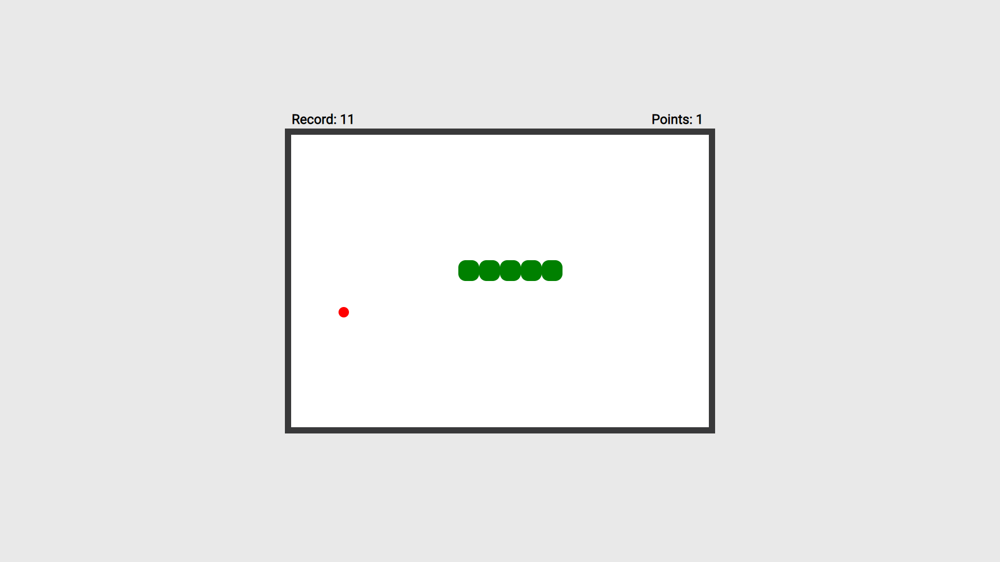

# Snake Game

My objective in creating this game was to learn about DOM manipulation with vanilla JavaScript and have fun.

---

---

### [See live version](https://tbence98.github.io/Snake/)

### Description

Snake is a classic game. The player has to eat as much food as possible while the snake becomes larger and making the game harder. Avoid hitting the walls or
yourself, otherwise the game is over. As you progress, the snake speed will increase. The controlls are: W: Forward, A: Left, S: Down, D: right.

### Features

- Tracking current score
- Keep track of the record in the local storage
- Render modal for game over and new record

### What did I learn?

- Working with the DOM and manipulating it
- Using the local storage and setTimeout API
